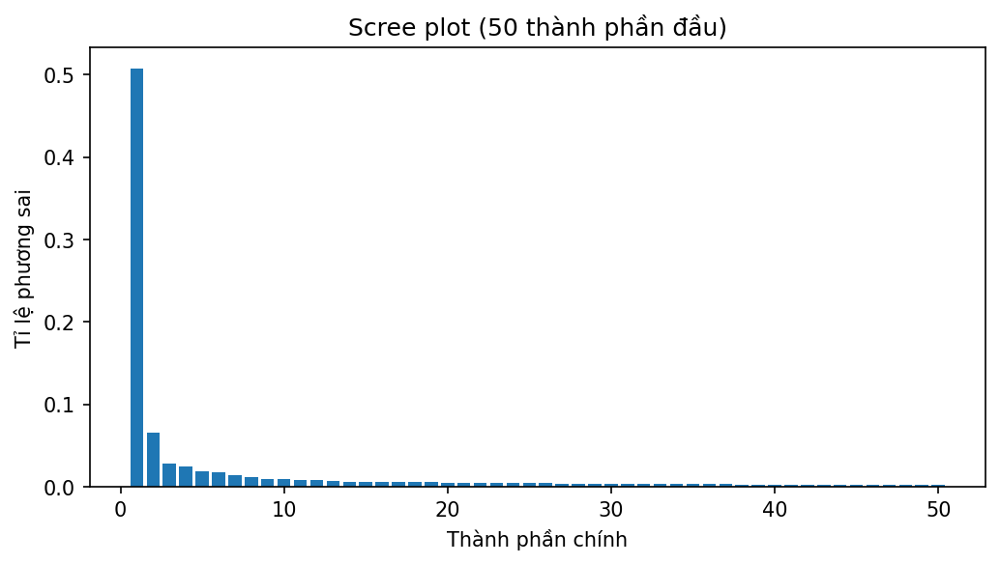
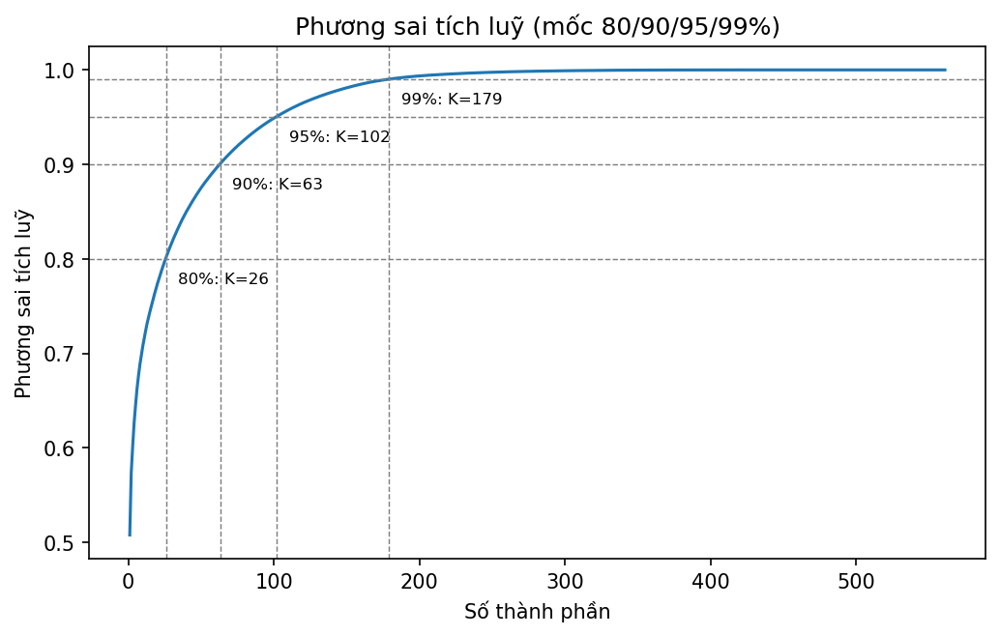
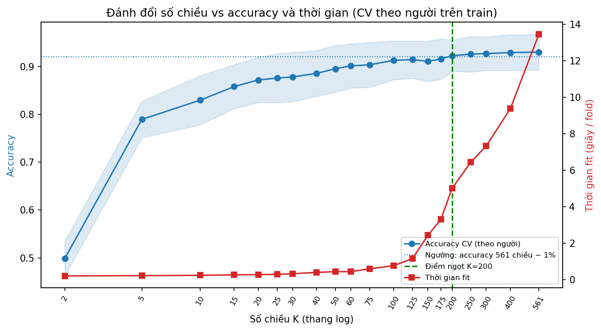
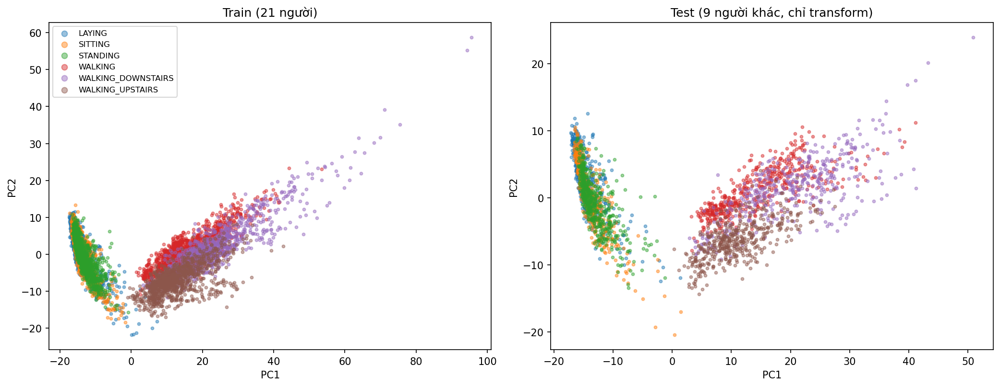
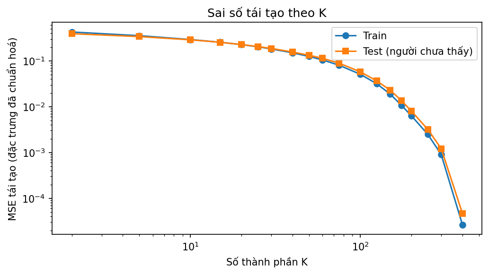

# TT-24 — PCA: nén 561 tín hiệu cảm biến cho thiết bị đeo

Bài toán: vòng đeo tay thu 561 chỉ số (gia tốc kế + con quay) để nhận biết 6 hoạt động; chip yếu (64 KB RAM, pin 7 ngày)
nên cần nén xuống vài chục–vài trăm chiều mà vẫn nhận dạng đúng. Dữ liệu: UCI HAR Smartphones
([link](https://archive.ics.uci.edu/dataset/240/human+activity+recognition+using+smartphones)).

## Kết quả chính

- **Điểm ngọt: K = 200** (giảm 64.3% số chiều), chọn bằng **cross-validation chia theo người trên tập train**, không dùng test.
  Quy tắc: K nhỏ nhất có accuracy CV ≥ accuracy CV của 561 chiều (0.9304) − 1%; PCA(K=200) đạt 0.9229.
- **Test (9 người chưa từng thấy, đánh giá một lần):** PCA K=200 accuracy **0.9518** so với **0.9623** khi dùng đủ 561 chiều
  (chênh +0.0105, VƯỢT dung sai 1% đặt ra trên CV). Độ lệch chuẩn accuracy giữa các fold CV tại K=200 là 0.0329, cùng cỡ hoặc lớn hơn mức chênh này, nên không nên đọc quá chi tiết sự khác biệt giữa các K lân cận.
- Dữ liệu train giảm từ **31.47 MB** xuống **11.22 MB** (float64); thời gian fit nhanh gấp **7.0 lần**.
- **Lưu ý triển khai (ước lượng phân tích, mục "Dung lượng"):** chuỗi scaler + PCA(K=200) + LinearSVC không gộp cần ~449.6 KB hằng số
  và 113,961 phép nhân-cộng mỗi cửa sổ, gấp 25.6× và 29.0× so với LinearSVC chạy thẳng trên 561 đặc trưng
  (17.6 KB; gộp tuyến tính còn 13.2 KB). Lợi ích của PCA ở bài này nằm ở dữ liệu lưu/truyền và thời gian huấn luyện, không ở suy luận.

## Cấu trúc & cách chạy

```
TT-24-PCA/
├── README.md                  ← sinh tự động từ notebook (số liệu luôn khớp code)
├── notebooks/pca_har_sensors.ipynb
├── src/{pca_pipeline.py, bieu_do.py, bao_cao.py}
├── tests/test_diem_ngot.py
├── models/pca_pipeline.joblib ← Pipeline(scale → PCA(K) → LinearSVC) đã fit trên train
├── reports/                   ← biểu đồ PNG + metrics.json + các bảng CSV
├── data/                      ← har_train.csv, har_test.csv (không commit)
└── requirements.txt
```

1. `pip install -r requirements.txt`
2. Đặt `har_train.csv`, `har_test.csv` vào `data/` (hoặc đặt biến môi trường `HAR_DATA_DIR`).
3. Mở `notebooks/pca_har_sensors.ipynb`, **Restart Kernel → Run All** (đường dẫn không phụ thuộc thư mục chạy; mọi `random_state=42`).
4. Kiểm thử: `pip install pytest && pytest`.

## Phương pháp (chống rò rỉ và cách chọn K)

- **Chia theo người, giữ nguyên bộ gốc:** 21 người train (7352 mẫu) / 9 người test (2947 mẫu), code kiểm tra không người nào trùng.
- **StandardScaler và PCA nằm trong `Pipeline`**, chỉ fit trên train (trong CV thì fit lại ở từng fold).
- **Chọn K bằng `GroupKFold(5)` theo người trên train**, lưới K dày (20 giá trị từ 2 đến 561).
  Không chọn K theo accuracy đo trên test (sẽ làm rò rỉ tập test vào quyết định), và lưới K phải đủ dày: với lưới thưa (…, 200, 561) so với accuracy đo trên test,
  tiêu chí "chênh < 1%" chỉ còn K=561, tức không giảm chiều nào. `tests/test_diem_ngot.py` có test cho đúng tình huống này.
- **Metric:** accuracy (lớp khá cân bằng) và macro-F1; có ma trận nhầm lẫn. Bộ phân loại: LinearSVC (C=1 mặc định, chưa tinh chỉnh).

## Scree plot, phương sai tích luỹ

 

| Nguong_phuong_sai | So_chieu_can | Ty_le_giam_chieu |
|---|---|---|
| 80% | 26 | 95.4% |
| 90% | 63 | 88.8% |
| 95% | 102 | 81.8% |
| 99% | 179 | 68.1% |

## Đánh đổi số chiều và độ chính xác (CV theo người, train)



| K | cv_accuracy | cv_accuracy_std | cv_f1_macro | thoi_gian_fit_s | ty_le_giam_chieu |
|---|---|---|---|---|---|
| 2 | 0.4985 | 0.0363 | 0.4601 | 0.21 | 99.6% |
| 5 | 0.7896 | 0.0383 | 0.7738 | 0.22 | 99.1% |
| 10 | 0.8298 | 0.0514 | 0.8217 | 0.24 | 98.2% |
| 15 | 0.8584 | 0.0462 | 0.8568 | 0.26 | 97.3% |
| 20 | 0.8722 | 0.0473 | 0.8714 | 0.28 | 96.4% |
| 25 | 0.8761 | 0.0511 | 0.8755 | 0.29 | 95.5% |
| 30 | 0.8784 | 0.0515 | 0.8773 | 0.33 | 94.7% |
| 40 | 0.8860 | 0.0481 | 0.8852 | 0.40 | 92.9% |
| 50 | 0.8957 | 0.0490 | 0.8953 | 0.44 | 91.1% |
| 60 | 0.9016 | 0.0461 | 0.9022 | 0.44 | 89.3% |
| 75 | 0.9038 | 0.0469 | 0.9036 | 0.59 | 86.6% |
| 100 | 0.9133 | 0.0406 | 0.9115 | 0.77 | 82.2% |
| 125 | 0.9146 | 0.0392 | 0.9120 | 1.16 | 77.7% |
| 150 | 0.9112 | 0.0422 | 0.9095 | 2.43 | 73.3% |
| 175 | 0.9161 | 0.0424 | 0.9153 | 3.30 | 68.8% |
| 200 | 0.9229 | 0.0329 | 0.9218 | 5.00 | 64.3% |
| 250 | 0.9262 | 0.0371 | 0.9250 | 6.44 | 55.4% |
| 300 | 0.9273 | 0.0350 | 0.9268 | 7.32 | 46.5% |
| 400 | 0.9295 | 0.0374 | 0.9289 | 9.37 | 28.7% |
| 561 | 0.9304 | 0.0371 | 0.9300 | 13.44 | 0.0% |

`thoi_gian_fit_s` là thời gian fit toàn pipeline (scale + PCA + LinearSVC) trung bình mỗi fold, trên máy chạy notebook.

## Đánh giá cuối trên test (một lần, sau khi đã chốt K)

| Mo_hinh | K | Accuracy | F1_macro | Thoi_gian_fit_s |
|---|---|---|---|---|
| PCA K=200 (điểm ngọt) | 200 | 0.9518 | 0.9521 | 2.82 |
| Không giảm chiều (561) | 561 | 0.9623 | 0.9626 | 19.64 |
| SelectKBest K=200 | 200 | 0.9471 | 0.9469 | 0.95 |

Cặp bị nhầm nhiều nhất của PCA K=200: SITTING → STANDING (61 ca); WALKING_UPSTAIRS → WALKING (27 ca); STANDING → SITTING (18 ca). Ma trận nhầm lẫn: `reports/confusion_pca.png`.

**So sánh SelectKBest cùng K (CV theo người):**

| K | PCA_cv_accuracy | SelectKBest_cv_accuracy |
|---|---|---|
| 10 | 0.8298 | 0.7518 |
| 25 | 0.8761 | 0.8683 |
| 50 | 0.8957 | 0.8788 |
| 100 | 0.9133 | 0.9183 |
| 200 | 0.9229 | 0.9264 |

Theo CV, PCA cao hơn SelectKBest ở K = 10, 25, 50; SelectKBest cao hơn ở K = 100, 200.

t-SNE chỉ để trực quan hoá (`reports/tsne_vs_pca.png`), không dùng làm tiền xử lý vì không có `transform` ổn định cho dữ liệu mới.

## PC1–PC2 và ý nghĩa PC1



PC1 giữ 50.8% phương sai. 10 đặc trưng gốc có |hệ số| lớn nhất (hệ số có dấu):

| dac_trung | he_so |
|---|---|
| fBodyAcc-sma() | 0.0586 |
| fBodyAccJerk-sma() | 0.0586 |
| tBodyAccJerk-sma() | 0.0585 |
| fBodyGyro-sma() | 0.0585 |
| tBodyAccJerkMag-mean() | 0.0585 |
| tBodyAccJerkMag-sma() | 0.0585 |
| fBodyBodyAccJerkMag-mean() | 0.0581 |
| fBodyBodyAccJerkMag-sma() | 0.0581 |
| tBodyAccJerkMag-mad() | 0.0580 |
| tBodyAccJerkMag-std() | 0.0580 |

Giá trị PC1 trung bình theo lớp (train): LAYING -14.3, SITTING -14.0, STANDING -13.5, WALKING_UPSTAIRS +12.9, WALKING +15.8, WALKING_DOWNSTAIRS +23.8.
10/10 đặc trưng top thuộc nhóm sma/Jerk/Mag/mad/std/energy (biên độ và năng lượng chuyển động). Các lớp chuyển động (WALKING*) nằm hẳn về một phía của PC1, các lớp tĩnh (SITTING, STANDING, LAYING) về phía kia, nên PC1 xấp xỉ **"mức vận động"** (dấu của PC là tuỳ ý). PC1 là tổ hợp tuyến tính của hàng trăm đặc trưng tương quan mạnh nên không có ý nghĩa vật lý trực tiếp.

## Dung lượng và triển khai trên thiết bị

| K | du_lieu_train_MB | kb_hang_so_float32 | kb_ma_tran_chieu_float32 | so_phep_nhan_cong | so_float_gui_di |
|---|---|---|---|---|---|
| 26 | 1.46 | 64.2 | 57.0 | 15303 | 26 |
| 63 | 3.53 | 146.1 | 138.1 | 36282 | 63 |
| 102 | 5.72 | 232.5 | 223.5 | 58395 | 102 |
| 179 | 10.04 | 403.1 | 392.3 | 102054 | 179 |
| 200 | 11.22 | 449.6 | 438.3 | 113961 | 200 |
| 561 | 31.47 | 17.6 | 0.0 | 3927 | 561 |

(`du_lieu_train_MB`: ma trận train float64, số liệu đo. Các cột còn lại là **ước lượng phân tích** cho suy luận 1 cửa sổ ở float32, không đo trên phần cứng.)

Nhận xét khi đưa vào thiết bị 64 KB RAM:
- Giảm chiều giúp rõ rệt ở **lưu trữ/truyền dữ liệu** (561 → 200 số mỗi cửa sổ) và **thời gian huấn luyện**.
- Với bộ phân loại **tuyến tính**, scaler + PCA + LinearSVC gộp được thành một ma trận 6×561 (13.2 KB float32;
  sai lệch so với pipeline gốc 6.8e-14), nên PCA **không giảm số phép tính suy luận** so với chạy thẳng 561 đặc trưng.
  PCA có lợi cho suy luận khi bộ phân loại phía sau tốn kém hơn (SVM kernel, mạng nơ-ron) hoặc khi phép chiếu thực hiện ở phía thu.
- Ma trận chiếu K×561 nên đặt ở flash (hằng số chỉ đọc); RAM chỉ cần bộ đệm cửa sổ và vector K chiều.
- Nếu mục tiêu là bớt việc tính đặc trưng trên chip, SelectKBest (chỉ tính K đặc trưng được giữ) mới thực sự tránh phải tính các đặc trưng còn lại; PCA vẫn cần cả 561.

## Sai số tái tạo theo K



| K | MSE_train | MSE_test |
|---|---|---|
| 2 | 0.4264 | 0.3917 |
| 5 | 0.3544 | 0.3387 |
| 10 | 0.2918 | 0.2880 |
| 15 | 0.2548 | 0.2542 |
| 20 | 0.2263 | 0.2267 |
| 25 | 0.2024 | 0.2049 |
| 30 | 0.1822 | 0.1866 |
| 40 | 0.1497 | 0.1557 |
| 50 | 0.1248 | 0.1324 |
| 60 | 0.1048 | 0.1137 |
| 75 | 0.0805 | 0.0892 |
| 100 | 0.0511 | 0.0578 |
| 125 | 0.0317 | 0.0365 |
| 150 | 0.0189 | 0.0231 |
| 175 | 0.0107 | 0.0135 |
| 200 | 0.0064 | 0.0080 |
| 250 | 0.0025 | 0.0032 |
| 300 | 0.0009 | 0.0012 |
| 400 | 0.0000 | 0.0000 |

## Hạn chế

- PCA tạo đặc trưng mới là tổ hợp tuyến tính của mọi đặc trưng cũ nên mất tính giải thích vật lý; PCA chỉ bắt quan hệ **tuyến tính**.
- CV chỉ có 21 người (5 fold, mỗi fold khoảng 4 người) nên điểm ngọt có nhiễu; test chỉ có 9 người.
- C của LinearSVC giữ mặc định, chưa tinh chỉnh cùng K; chưa thử Kernel PCA / IncrementalPCA.
- 561 đặc trưng là đặc trưng thủ công đã trích sẵn từ cửa sổ tín hiệu; chi phí tính chúng trên thiết bị không nằm trong các con số trên.
- Số liệu RAM/phép tính là ước lượng phân tích, chưa đo trên chip thật.
